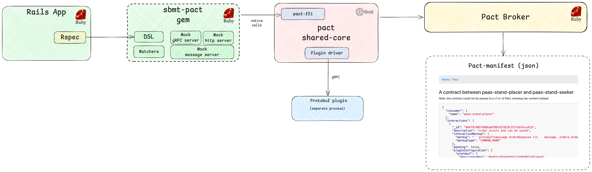

# Sbmt Pact

**`sbmt-pact`** is a powerful Ruby gem designed to simplify and streamline [Pact](https://docs.pact.io/) testing between microservices. This gem provides a robust set of RSpec utilities to help developers implement consumer-driven contract testing in microservice architectures.

In the world of microservices, ensuring seamless communication between services is crucial. This gem leverages the Pact to enable effective contract testing, allowing you to catch integration issues early in the development cycle. Contract testing is a way to check if different parts of a system work well together. It's like making sure two puzzle pieces fit perfectly before assembling the whole puzzle. Each part is tested on its own to see if it follows a set of rules (the "contract") that everyone agreed on. This helps catch problems early and makes sure all parts of the system speak the same language.

## Motivation

Currently, the existing version of the [pact-ruby](https://github.com/pact-foundation/pact-ruby) gem only supports Pact Specification versions v1 and v2, which doesn't allow for:
- Writing contract tests with non-HTTP transports (for example, gRPC)
- Writing contract tests for async messages (Kafka, etc.)

The `pact-ruby` gem is in maintenance mode, as there has been a transition to rust-core, which is intended to be used through FFI in non-Rust stacks.

This gem eliminates the above-mentioned limitations and implements support for the latest versions of Pact specifications:
- It's based on pact-ffi and pact-ruby-ffi
- It provides a convenient DSL, simplifying the writing of contract tests in Ruby/RSpec

## Architecture



- DSL - implementation of RSpec-DSL for convenient writing of Pact tests
- Matchers - implementation of Pact matchers, which are convenient helpers used in consumer-DSL, encapsulating all the logic for serialization into Pact format
- Mock servers - mock servers that allow for correct execution of provider tests

## Usage

For each type of interaction (due to their specific features), a separate version of DSL has been implemented. However, the general principles remain the same for each type of interaction.

```ruby

# Declaration of a consumer test, always include the :pact tag
# This is used in CI/CD pipelines to separate Pact tests from other RSpec tests
# Pact tests are not run as part of the general RSpec pipeline
RSpec.describe "SomePactConsumerTestForAnyTransport", :pact do
  # declaration of the type of interaction - here we determine which consumer and provider interact on which transport
  has_http_pact_between "CONSUMER-NAME", "PROVIDER-NAME"
  # or
  has_grpc_pact_between "CONSUMER-NAME", "PROVIDER-NAME"
  # or
  has_message_pact_between "CONSUMER-NAME", "PROVIDER-NAME"

  # the context for one of the interactions, for example GET /api/v2/stores
  context "with GET /api/v2/stores" do
      let(:interaction) do
        # creating a new interaction - within which we describe the contract
        new_interaction
          # if you need to save any metadata for subsequent use by the test provider,
          # for example, specify the entity ID that will need to be moved to the database in the test provider
          # we use the provider states, see more at https://docs.pact.io/getting_started/provider_states
          .given("UNIQUE PROVIDER STATE", key1: value1, key2: value2)
          # the description of the interaction, used for identification inside the package binding,
          # is optional in some cases, but it is recommended to always specify
          .upon_receiving("UNIQUE INTERACTION DESCRIPTION")
          # the description of the request using the matchers
          # the name and parameters of the method differ for different transports
          .with_request(...)
          # the description of the response using the matchers
          # the name and parameters of the method differ for different transports
          .with_response(...)
          # further, there are differences for different types of transports,
          # for more information, see the relevant sections of the documentation
      end

      it "executes the pact test without errors" do
        interaction.execute do
          # here our client is called for the API being tested
          # in this context, the client can be: http client, grpc client, kafka consumer
          expect(make_request).to be_success
        end
      end
    end
  end

```

Common DSL Methods:
- `new_interaction` - initializes a new interaction
- `given` - allows specifying a provider state with or without parameters, for more details see https://docs.pact.io/getting_started/provider_states
- `upon_receiving` - allows specifying the name of the interaction

### HTTP consumers

Specific DSL methods:
- `with_request(HTTP_METHOD, QUERY_PATH, {headers: kv_hash, body: kv_hash})` - request definition
- `with_response(HTTP_STATUS, {headers: kv_hash, body: kv_hash})` - response definition

More at [http_client_spec.rb](spec/pact/providers/sbmt-pact-test-app/http_client_spec.rb)

### gRPC consumers

Specific DSL methods:
- `with_service(PROTO_PATH, RPC_SERVICE_AND_ACTION)` - specifies the contract used, PROTO_PATH is relative from the app root
- `with_request(request_kv_hash)` - request definition
- `with_response(response_kv_hash)` - response definition

More at [grpc_client_spec.rb](spec/pact/providers/sbmt-pact-test-app/grpc_client_spec.rb)

### Kafka consumers

Specific DSL methods:
- `with_headers(kv_hash)` - message-headers definition; you can use matchers
- `with_metadata(kv_hash)` - message-metadata definition (special keys are `key` and `topic`, where, respectively, you can specify the matchers for the partitioning key and the topic

Next, the specifics are one of two options for describing the format:

**JSON** (to describe a message in a JSON representation):
- `with_json_contents(kv_hash)` - message format definition

**PROTO** (to describe the message in the protobuf view):
- `with_proto_class(PROTO_PATH, PROTO_MESSAGE_NAME)` - specifies the contract used, PROTO_PATH is relative to the root, PROTO_MESSAGE_NAME is the name of the message used from the proto file
- `with_proto_contents(kv_hash)` - message format definition

More at [kafka_spec.rb](spec/pact/providers/sbmt-pact-test-app/kafka_spec.rb)

### Matchers

Matchers are special helper methods that allow you to define rules for matching request/response parameters at the level of the pact manifest.
The matchers are described in the [Pact specifications](https://github.com/pact-foundation/pact-specification). In this gem, the matchers are implemented as RSpec helpers.

For details of the implementation, see [matchers.rb](lib/sbmt/pact/matchers.rb)

- `match_exactly(sample)` - match the exact value specified in the sample
- `match_type_of(sample)` - match the data type (integer, string, boolean) specified in the sample
- `match_include(sample)` - match a substring
- `match_any_string(sample)` - match any string, because of the peculiarities, null and empty strings will also be matched here
- `match_any_integer(sample)` - match any integer
- `match_any_decimal(sample)` - match any float/double
- `match_any_number(sample)` - match any integer/float/double
- `match_any_boolean(sample)` - match any true/false
- `match_uuid(sample)` - match any UUID (`match_regex` is used under the hood)
- `match_regex(regex, sample)` - match by regexp
- `match_datetime(format, sample)` - match any datetime
- `match_iso8601(sample)` - match datetime in ISO8601 (the matcher does not fully comply with ISO8601, matches only the most common variants, `match_regex` is used under the hood)
- `match_date(format, sample)` - match any date (rust datetime)
- `match_time(format, sample)` - match any time (rust datetime)
- `match_each(template)` - match all the elements of the array according to the specified template, you can use it for nested elements
- `match_each_regex(regex, sample)` - match all array elements by regex, used for arrays with string elements
- `match_each_key(template, key_matchers)` - match each hash key according to the specified template
- `match_each_value(template)` - match each hash value according to the specified template, can be used for nested elements
- `match_each_kv(template, key_matchers)` - match all the keys/values of Hash according to the specified template and key_matchers, can be used for nested elements

See the different uses of the matchers in [matchers_spec.rb](spec/sbmt/pact/matchers_spec.rb)

## Development & Test

Install [Dip](https://github.com/bibendi/dip)

### Setup

```shell
dip provision
```

### Run unit tests

```shell
dip rspec
```

### Run pact tests

The Pact tests are not run within the general rspec pipeline, they need to be run separately, see below

#### Consumer tests

```shell
dip pact consumer
# or
bundle exec rspec -t pact spec/pact/providers/**/*_spec.rb
```

**NOTE** If you have never run it, you need to run it at least once to generate json-pact manifests that will be used in provider tests (below)

#### Provider tests

```shell
dip pact provider
# or
bundle exec rspec -t pact spec/pact/consumers/*_spec.rb
```

#### Using Pact Broker locally

If you need to check the ability to work with a package broker locally, you need to do the following:

- Run the broker

```shell
$ dip up pact-broker
```

- Run consumer tests to generate a pact manifest (it will be created in `spec/internal/pacts` based on the results of successful completion of consumer tests)

```shell
$ dip pact consumer
```

- Publish the generated pact manifest in the pact broker

```shell
$ dip pact-cli publish
```

- Make sure that the manifest is published by opening it in a browser http://localhost:9292 (don't forget to forward port 9292 to localhost, see `docker-compose.yml`)

- run provider tests using a pact broker

```shell
$ dip pact provider-with-local-broker
```
